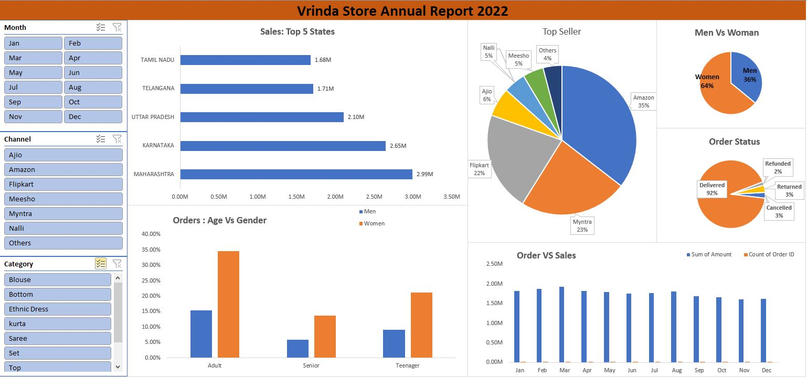

# Vrinda Store Data Analysis Project

## Project Overview

The **Vrinda Store Data Analysis Project** aims to create an interactive dashboard to analyze the annual sales report for the year 2022. By examining the sales data, the project seeks to provide actionable insights to help the Vrinda Store owner understand customer behavior, identify trends, and make informed decisions for boosting sales in the upcoming year.

## Dataset

The analysis is based on the **Vrinda Store Data** dataset.

## Key Questions and Objectives

1. **Comparing Sales and Orders:** Visualize the comparison between sales and order counts in a single chart.
2. **Identifying Highest Sales Month:** Determine the month with the highest sales and order count.
3. **Gender-based Analysis:** Analyze purchasing patterns to determine whether more purchases are made by men or women.
4. **Order Status Breakdown:** Identify the various order statuses that occurred in 2022.
5. **Top Sales Contributing States:** List the top 10 states that contribute the most to the sales.
6. **Age and Gender Insights:** Explore the relationship between age and gender based on the number of orders.
7. **Sales Channel Analysis:** Determine the sales contribution from different channels.
8. **Top Selling Category:** Identify the highest selling product category.

## Analysis Process

1. **Data Verification:** Checked for missing values and anomalies to ensure data integrity.
2. **Data Cleaning:** Ensured consistent data types, formats, and values for accurate analysis.
3. **Pivot Table Creation:** Developed pivot tables for each key question to summarize relevant data.
4. **Interactive Dashboard:** Integrated pivot tables into an interactive dashboard and incorporated slicers for dynamic exploration.

## Interactive Dashboard

## Project Insights

1. Women customers account for approximately 65% of total purchases, indicating a strong buying presence.
2. The top three buying states are Maharashtra, Karnataka, and Uttar Pradesh, which should be prioritized for targeted efforts.
3. The age group of 30-49 years contributes the most to sales (around 50%), making it a vital demographic.
4. Key purchasing channels include Amazon, Flipkart, and Myntra.
5. The highest selling product category has been identified for focused marketing strategies.

## Conclusion

To enhance Vrinda Store's sales in 2023:
- Target women customers aged 30-49 residing in Maharashtra, Karnataka, and Uttar Pradesh.
- Leverage Amazon, Flipkart, and Myntra as primary marketing channels for maximum impact.
